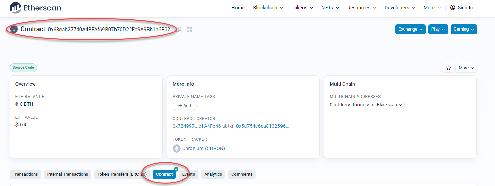
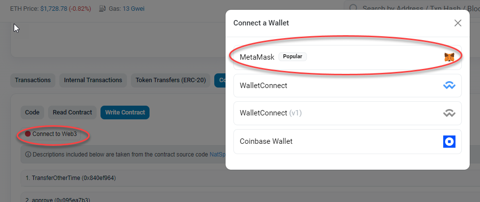
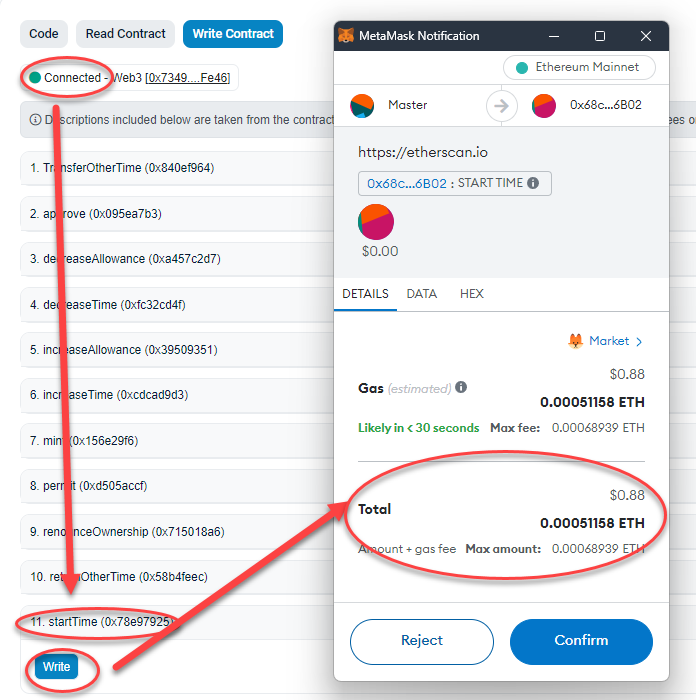
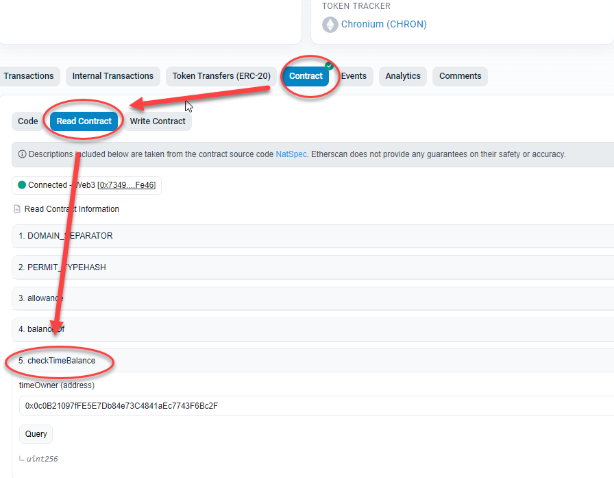

# Chronium

## 1. Summary

The Chronium contract is an ERC20 token that utilizes the concept of time as a "balance." The contract has a mapping to keep track of the timestamp of each account, which allows the contract to calculate a time balance for every account. Chronium can only be distilled using time balance, which is different from minting, as minting is an outright issuing of tokens. Overall, this contract allows for a unique functionality where users can earn tokens based on their ownership of time.

## 2. Deployed Addresses and Artifacts

-   **[Mainnet](./deployed/mainnet.json)**

```json
{
    "Chronium": "0x68cab27740A4BFAf69B07b70D22Ec9A9Bb1b6B02",
    "ChroniumDistillery": "0x93Ac7c248B80dcFe853DD7328f627Aee17064485"
}
```

-   **[Goerli](./deployed/mainnet.json)**

```json
{
    "Chronium": "0x6D70c2B4862D20Efa5817488b2D3ceFBbB1b0d08",
    "ChroniumDistillery": "0x86bB9eA7B2Ded5C47E710f8b621E4639B166B453"
}
```

-   **[Chronium Contract Artifact](./deployed/Chronium.json)**

https://raw.githubusercontent.com/RoyLai-InfoCorp/chronium-v1/Development/deployed/ChroniumDistilleryV1.json

-   **[Chronium Distillery Contract Artifact](./deployed/ChroniumDistillery.json)**

https://raw.githubusercontent.com/RoyLai-InfoCorp/chronium-v1/Development/deployed/ChroniumDistilleryV1.json

---

## 3. Getting Started

### Step 1: Make Time

a) Open etherscan.io at this addresss **0x68cab27740A4BFAf69B07b70D22Ec9A9Bb1b6B02** and click on **Contract** button.



b) Click on **Connect to Web3** and connect to your MetaMask account.  
**NOTE: Make sure you are on mainnet**.



c) Click on **Write Contract** and call the **startTime()** function. You will be prompted by MetaMask to approve the transaction. Click **Confirm** to proceed.



### Step 2: Check Time Balance

a) Open etherscan.io at this addresss **0x68cab27740A4BFAf69B07b70D22Ec9A9Bb1b6B02** and click on **Contract** button again.

b) Click on **Read Contract** and call **checkTimeBalance()**. This will return the amount of time accrued.



### Step 3: Distill

To distill Chronium tokens, go to **ChroniumDistillery** contract at **0x93Ac7c248B80dcFe853DD7328f627Aee17064485** and call the **distill()** function.

### Step 4: Check Chronium Balance

Go back to the **Chronium** contract at **0x6D70c2B4862D20Efa5817488b2D3ceFBbB1b0d08** and call the ERC20 **balanceOf()** function.

---

## 4. Example: Deploy and Testing Chronium Locally

### Step 1. Download and Setup

**a) Clone the repository and install the packages**

```bash
git clone https://github.com/RoyLai-InfoCorp/chronium-v1.git --recursive && cd chronium-v1
npm i
```

**b) Create .env file**

```bash
CHRONIUM_LOCAL__MNEMONIC='...'
```

**c) Start Hardhat Local Network**

```sh
hh node
```

### Step 2. Deploy Locally

**a) Create deploy.js under scripts directory**

```js
const { ethers, upgrades, network } = require("hardhat");
const fs = require("fs");
const networkName = network.name;

(async () => {
    const accounts = await ethers.getSigners();

    // DEPLOY AND INIT CHRONIUM
    const Chronium = await ethers.getContractFactory("Chronium");
    const chronium = await Chronium.deploy(
        "Chronium",
        "CHRON",
        accounts[0].address
    );

    // DEPLOY AND INIT DISTILLERY PROXY
    const Distillery = await ethers.getContractFactory("ChroniumDistilleryV1");
    const distillery = await upgrades.deployProxy(
        Distillery,
        [chronium.address, 1, accounts[0].address],
        { initializer: "__ChroniumDistilleryV1_Init" }
    );

    // TRANSFER CHRONIUM OWNERSHIP TO DISTILLERY
    await chronium.transferOwnership(distillery.address);

    const contracts = {
        Chronium: chronium.address,
        ChroniumDistillery: distillery.address,
    };
    console.log(contracts);
    fs.writeFileSync(
        `./deployed/${networkName}.json`,
        JSON.stringify(contracts, null, 4)
    );
})()
    .catch((e) => {
        console.log(e);
    })
    .finally(() => {
        process.exit(0);
    });
```

**b) Deploy to localhost**

```sh
hh run scripts/deploy.js --network localhost
```

Once the contracts are deployed, the contract addresses will be saved in `localhost.json` under `deployed` directory.

### Step 3. Make Time

**a) Create make-time.js under scripts directory**

```js
const { ethers } = require("hardhat");

const deployed = {
    adddresses: require("../deployed/localhost.json"),
};

(async () => {
    const account = await ethers.getSigner();
    const chronium = await ethers.getContractAt(
        "Chronium",
        deployed.adddresses.Chronium
    );
    const time = await chronium.checkTimeBalance(account.address);
    if (time == 0) {
        console.log(`Your Time Balance is ${time}`);
        console.log("Call startTime() to start making time.");
        await chronium.startTime();
        console.log(
            "You have started making time. Please check your time balance again later."
        );
    } else {
        console.log(`Your Time Balance is ${time}`);
        console.log("Use ChroniumDistillery to distill time into Chronium");
    }
})();
```

**b) Run script**

```sh
hh run scripts/make-time.js --network localhost
```

### Step 4. Distill Chronium

**a) Create distill-chronium.js under scripts directory**

```js
(async () => {
    const account = await ethers.getSigner();

    const chronium = new ethers.Contract(
        deployed.adddresses.Chronium,
        deployed.artifacts.Chronium.abi,
        account
    );
    console.log(account.address);
    const time = await chronium.checkTimeBalance(account.address);
    if (time == 0) {
        console.log(`Your Time Balance is ${time}`);
        console.log("Call startTime() to start making time.");
        await chronium.startTime();
        console.log(
            "You have started making time. Please check your time balance again later."
        );
    } else {
        console.log(`Your Time Balance is ${time}`);
        console.log("Use ChroniumDistillery to convert time into Chronium");
    }
})();
```

**b) Run script**

```js
hh run scripts/distill-chronium.js --network localhost
```

---

## 5. Contracts

The `Chronium` contract is an ERC20 token that is minted using time balance based on block.number - timestamp. The transfer of individual time can be tracked under a sub-account, which can be used to borrow or reserve a third-party's time.

### A. Chronium Contract

#### Contract Properties

-   `timestamp`: The mapping of time balance based on block number and timestamp.
-   `transferrableTimeBalances`: The mapping of transferred time balances between sender and recipient.
-   `deployed`: The block number when the contract was deployed.
-   `DOMAIN_SEPARATOR`: keccak256 hash for EIP712 domain separator.
-   `PERMIT_TYPEHASH`: The keccak256 hash for permit function.
-   `nonces`: Keeps track of nonces for permit function.

#### Constructor Function

-   `constructor(string memory name, string memory symbol, address governance)`: Initializes the contract by setting up its Token Name, Symbol and Governance Address, as well as its domain separator and deployed blocks.

#### External Public Functions

**a) Time Transferability Functions:**

-   `transferOwnTime(address recipient, uint256 amount)`: Transfers sender's own time and adds it to the sender's subaccount under the recipient.
-   `returnOtherTime(address originator,uint256 amount)`: Returns transferred originator's time under the sender's subaccount back to the originator.
-   `TransferOtherTime(address originator, address recipient, uint256 amount)`: Transfers originator's time from its own subaccount to others.

**b) Time Checking Functions:**

-   `checkTimeBalance(address timeOwner)`: Checks the current time balance of an account.

**c) Emission Functions:**

-   `mint(address recipient, uint256 time, uint256 amt)`: Mints the given amount of Chronium tokens to the recipient's address using the given time balance.

#### Modifier

-   `onlyOwner()`: Restricts the access to only the contract owner.

#### Events

-   `LogStartTime(address Account,uint256 Amount)`: Logs the start of timestamp tracking.
-   `LogTransferOwnTime(address sender, address recipient, uint256 amount)`: Logs the transfer of sender's own time to a recipient.
-   `LogReturnOtherTime(address sender, address originator, uint256 amount)`: Logs the return of transferred originator's time back to the originator.
-   `LogTransferOtherTime(address sender, address originator, address recipient, uint256 amount)`: Logs the transfer of originator's time from its own subaccount to others.

### B. ChroniumDistilleryV1 Contract

The `ChroniumDistilleryV1` contract is a faucet contract for the Chronium token. It converts time into Chronium through distillation, which is different from minting, as minting is an outright issuing of tokens.

#### Contract Properties

-   `_chronium`: Address of the Chronium token contract.
-   `defaultEmissionRate`: The default emission rate to use for distillation.

#### Initialization Function

-   `__ChroniumDistilleryV1_Init(address chronium, uint256 defaultEmissionRate_, address governance)`: Initializes the contract by setting up its Chronium Token Address, Default Emission Rate and Governance Address.

#### External Public Functions

**a) Distillation Functions:**

-   `distill(uint256 time)`: Converts the given time balance into Chronium tokens using the default emission rate and mints that amount of tokens to the sender’s address.

#### Modifier

-   `onlyOwner()`: Restricts the access to only the contract owner.

#### Events

-   `LogSetDefaultEmissionRate(address sender, uint256 rate)`: Logs the change on default emission rate.
-   `LogDistill(address timeOwner, uint256 time, uint256 amount)`: Logs the successful distillation process with details such as Time Owner, Time Amount and Chronium Amount.
